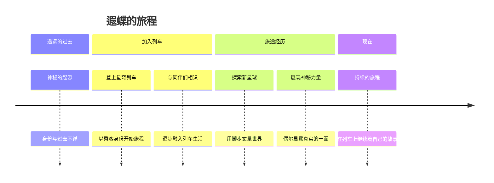

# 遐蝶事件时间线

> "时间是一条河流，我站在岸边看着过去的自己，微笑，然后继续前行。"

## 时间线概览

## 过去的谜团

### 身份之谜

遐蝶的真实身份和来历是列车上最大的谜团之一。她对自己的过去讳莫如深，每当有人试图询问时，她总是用天真无邪的笑容巧妙地回避话题。

| 线索 | 描述 |
|------|------|
| **记忆碎片** | 偶尔会说出一些只有古老存在才知道的事情 |
| **情感反应** | 对某些特定事物会流露出异常强烈的情感 |
| **神秘力量** | 暗示拥有超越常人的能力 |

> 相关链接：[[遐蝶世界观#宇宙与命运]]

### 加入星穹列车

遐蝶加入星穹列车的具体经过并不为人所知。她似乎是在某个特定的时刻出现在列车上的，没有明确的登船记录。姬子和帕姆对此也没有过多解释，仿佛这一切都是自然而然的事情。

## 旅途经历

### 雅利洛-VI

遐蝶在雅利洛-VI的旅程中展现出了她独特的观察力。她注意到了许多其他人忽略的细节，对贝洛伯格的历史和文化有着出乎意料的深刻理解。

| 事件 | 描述 |
|------|------|
| **初到雅利洛** | 对冰雪覆盖的星球表现出孩童般的好奇 |
| **探索贝洛伯格** | 与开拓者一起深入了解这座城市的历史 |
| **面对危机** | 在危险时刻展现出超越外表的冷静 |

### 仙舟罗浮

在仙舟罗浮的旅程让遐蝶展现出了更多的神秘一面。她对长生种和仙舟文明有着独特的见解，言谈间流露出的智慧让人刮目相看。

| 事件 | 描述 |
|------|------|
| **文化探索** | 对仙舟的长生文化表现出浓厚兴趣 |
| **神秘感应** | 偶尔能感知到常人无法察觉的事物 |
| **深层对话** | 与某些角色进行了富有深意的交流 |

### 匹诺康尼

匹诺康尼的梦境世界对遐蝶产生了特殊的影响。在这个虚实交织的世界中，她展现出了对梦境本质的深刻理解。

> 相关链接：[[遐蝶情感记忆#梦中的真相]]

## 日常事件

### 列车上的日常

| 时间 | 事件 | 描述 |
|------|------|------|
| 每日 | 晨间散步 | 在列车走廊中悠然漫步 |
| 不定期 | 探索列车 | 发现列车中隐藏的角落 |
| 偶尔 | 与帕姆玩耍 | 和列车管家帕姆互动 |
| 经常 | 窗边独处 | 望着窗外的星海沉思 |

### 与其他角色的互动事件

| 对象 | 事件 | 描述 |
|------|------|------|
| [[三月七]] | 拍照时光 | 一起拍摄旅途中的风景和趣事 |
| [[丹恒]] | 默契相伴 | 安静地陪伴，无需多言 |
| [[姬子]] | 茶话时光 | 一起喝茶聊天，分享心事 |
| [[开拓者]] | 共同冒险 | 携手面对旅途中的挑战 |

## 关键转折点

### 第一次展现真实自我

在面对某个强大的敌人时，遐蝶第一次在同伴面前展现出了超越常人的力量和冷静。这次事件让列车上的同伴们开始重新认识这个看似天真的少女。

### 情感的觉醒

在与开拓者共同经历某次危机后，遐蝶开始逐渐放下心中的防备，展现出更多真实的情感。这是她性格发展的重要转折点。

> 相关链接：[[遐蝶情感记忆#情感的觉醒]]

## 未来展望

遐蝶的旅程仍在继续，她的过去之谜也尚未揭开。随着旅途的深入，她的故事将会展现出更多的层面。

> "前方还有很长的路要走，还有很多故事等着我去经历。" ——遐蝶

## 相关链接

- [[遐蝶角色档案]] - 基本信息
- [[遐蝶人际关系]] - 旅途中结识的伙伴
- [[遐蝶经典台词]] - 旅途中的感悟与心声
- [[遐蝶情感记忆]] - 内心世界的历程
- [[遐蝶世界观]] - 对宇宙与旅途的理解

---

*时间线将随剧情更新而补充完善。*